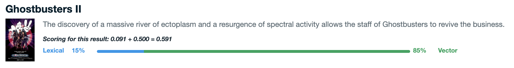

# Atlas Hybrid Search
This is a simple NextJS app that allows you to run Fulltext Search (FTS) and Vector Search queries against a MongoDB Atlas instance.

## About Hybrid Search
The app is set up so that you can run hybrid search queries that combine text search (or lexical retrieval) alongside vector search (or semantic retrieval) and return a single merged result set. This merged set is created by using a rank fusion algorithm. This app currently implements Relative Score Fusion (RSF) and Reciprocal Rank Fusion (RRF).


## Configuring the algorithms
For the hybrid search algorithms you can modify the behaviour by changing the parameters using the sliders on the left.

## Scoring
For both RSF and RRF algorithms the weighted and/or normalized text and vector scores are calculated and then summed to give the final score. The results show what proportion of each went into the final score for each document.

## Embeddings
In order to perform vector search the input text query must be encoded (turned into a vector) using an embedding model. Byt default this is done using OpenAI's ada-002 model and the API key provided in the `.env` file. This is because the default sample data (see below) has been encoded using this same model. The model used for document and query embeddings must be the same.

At the moment the app is set so you can switch between OpenAI and Azure OpenAI. To use Azure simply set your `OPENAIDEPLOYMENT` and `OPENAIENDPOINT` variables in the `.env` file.


If you are confident with code you could add another embedding API by modifying the [app's API layer](pages/api/embed.js) and the [embedding model](middleware/model).

### In the application
In the app the API call to embed the query is made only when the 'vector search' button is selected. The search queries to the database are run each time the parameter values are changed or the different tabs are selected. But the query vector is not regenerated.



## Prerequisites
1. You will need access to an Atlas Cluster.
2. [Node installed](https://nodejs.org/en/learn/getting-started/how-to-install-nodejs)
3. Load sample data into Atlas (optional to make the default examples work)
4. Create search indexes

## Load MongoDB Sample Data (optional)
To get the default setup to work you need to [load sample data](https://www.mongodb.com/docs/atlas/sample-data/) into your Atlas Cluster.

If you opt not to use the sample data you will need to modify the variables in [`config.mjs`](config.mjs) to work with your schema and make sure you have embedded data (see below).

You will also need to make sure that the `MDB_SEARCHIDX`, and `MDB_VECTORIDX` schema variables are set appropriately. These variables are used when running searches and for hybrid search to join vector results with text search results.

## Embed Data (optional)
If not using the sample embedded data provided by MongoDB you will need to use data embedded using one of the [supported providers](middleware/model/). You can do this by using the supplied script to embed data in an existing Atlas Collection. The script is designed to work with the search application by using the same [schema configuration](config.mjs) and [environment variables](example.env).

Once you have set you `.env` file and `config.mjs` you will need to start the app. This hosts a local embedding API that uses the model provider corresponding to the supplied API key.

Run
```
npm build
npm start
```

Now you can start the embedding process. NOTE - this process could be long running, we recommend only using this script for small sample datasets. For larger datasets choose a more scalable embedding approach. For example: [Pat Wendorf's VectorStream](https://github.com/patw/VectorStream).

Run
```
node embed-data.mjs
```

## Create search indexes
You must have created your `.env` by copying and renaming the `example.env` provided as the `create-search-indexes.mjs` script uses these values. If you are not using the `sample_mflix.embedded_movies` data then you must modify the search index definitions in the script to match your schema.

Run
```
node create-search-indexes.mjs
```

## Run the app
```
npm run dev
```

## Build for deployment
```
npm build
npm start
```

